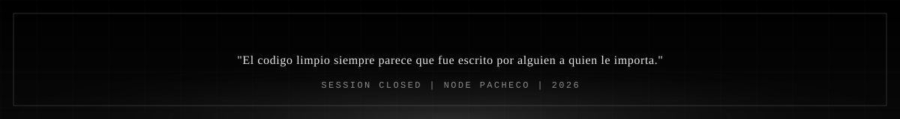

<div align="center">

  

  <br/>

```
┌─[ root@pacheco ]-[~]─────────────────────────────────────────┐
│  OS      Ubuntu Linux                                        │
│  ROLE    Full-Stack & Backend Developer                      │
│  FOCUS   APIs RESTful · arquitectura · sistemas escalables   │
│  NODE    UniCosta x Riwi                                     │
│  STATE   ACTIVE                                              │
└──────────────────────────────────────────────────── $ whoami ┘
```

  <a href="https://git.io/typing-svg">
    
  </a>

  <br/>

  <a href="https://www.linkedin.com/in/edgardopachecoo" target="_blank">
    
  </a>
  <a href="mailto:pachecoedgardo12345@correo.com" target="_blank">
    
  </a>
  <a href="https://portafolioedgardo.vercel.app/" target="_blank">
    
  </a>

</div>


<pre>
  [ 01 ]  IDENTITY
  ────────────────────────────────────────────────────────────────────
</pre>

```
$ cat /etc/profile.d/operator.sh
```

- **Formacion academica:** Estudiante de Ingenieria de Sistemas en la Universidad de la Costa y Software Development Trainee en Riwi. Formacion tecnica en diseno grafico y diplomado en analisis de datos — vision integral del ciclo de vida del software.
- **Enfoque tecnico:** APIs RESTful y arquitecturas backend limpias con **C# / .NET** y el ecosistema **Node.js / Express**.
- **Aprendizaje activo:** DevSecOps, ciberseguridad y despliegue de modelos de Inteligencia Artificial en entornos locales.
- **Entorno de trabajo:** Linux Ubuntu. Despliegues con Docker, control de versiones con Git / GitHub y administracion de bases de datos locales y en la nube.
- **Fuera del codigo:** Liga universitaria de baloncesto. Disciplina de fuerza e hipertrofia en el gimnasio.


<pre>
  [ 02 ]  OPERATIONS
  ────────────────────────────────────────────────────────────────────
</pre>

<table width="100%">
  <tr>
    <td width="33%" valign="top">
      <pre>
 PATILLADASH
 CLASS  ·  PRODUCTION
      </pre>
      <p>Plataforma SaaS multi-sede en produccion para gestion de bebidas artesanales. BI, auditoria de caja en tiempo real y wizard de ventas movil.</p>
      <p>
        
        
        
        
        
      </p>
      <a href="https://github.com/pachecoedgardo2006-coder/PatillaDash">
        
      </a>
    </td>
    <td width="33%" valign="top">
      <pre>
 HOUSE GRILL 6
 CLASS  ·  ADMIN CORE
      </pre>
      <p>Dashboard administrativo completo para restaurantes. Gestion de menu, pedidos e integracion en tiempo real con transacciones SQL atomicas.</p>
      <p>
        
        
        
        
      </p>
      <a href="https://github.com/pachecoedgardo2006-coder/HOUSE-GRILL-6">
        
      </a>
    </td>
    <td width="33%" valign="top">
      <pre>
 GYMQUEST
 CLASS  ·  SECURE API
      </pre>
      <p>Backend corporativo bajo Clean Architecture. Patrones de diseno, Entity Framework y autenticacion JWT segura.</p>
      <p>
        
        
        
        
      </p>
      <a href="https://github.com/pachecoedgardo2006-coder/GymQuest">
        
      </a>
    </td>
  </tr>
</table>


<pre>
  [ 03 ]  ARSENAL
  ────────────────────────────────────────────────────────────────────
</pre>

<div align="center">

```
$ ls /opt/arsenal --classified
```

**Lenguajes & Runtimes**

<p>
  
  
  
  
  
  
  
</p>

**Backend, Arquitectura & Seguridad**

<p>
  
  
  
  
  
  
  
</p>

**Bases de Datos, ORMs & Herramientas BD**

<p>
  
  
  
  
  
  
</p>

**Frontend & UI/UX**

<p>
  
  
  
  
  
  
</p>

**Data Analysis & Herramientas de Negocio**

<p>
  
  
  
  
</p>

**Testing, QA & Documentacion**

<p>
  
  
  
  
  
  
</p>

**DevOps, Cloud & Entorno de Desarrollo**

<p>
  
  
  
  
  
  
</p>

</div>


